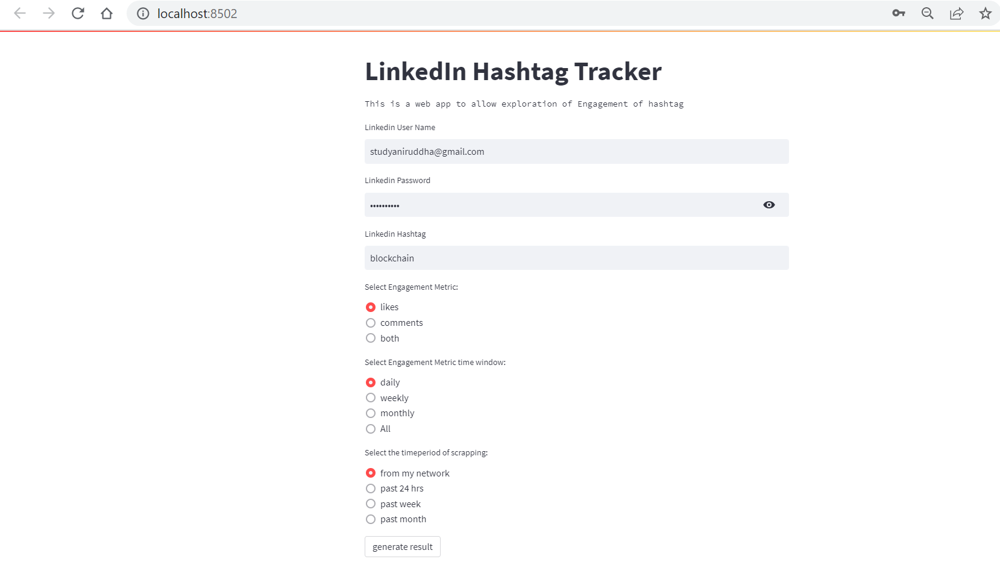

# GitHub MARKDOWN

# **LinkedIn Hashtag Tracker**

The LinkedIn Hashtag Tracker is a tool that helps track the engagement of a LinkedIn hashtag by scraping LinkedIn for the relevant posts using the hashtags, extracting data such as the date of the post, the number of likes, and the number of comments, and plotting a chart to show the engagement analytics.

[Demo.webm](readme/Demo.webm)

## **Getting Started**

To use the LinkedIn Hashtag Tracker, you will need to have Python 3 installed on your computer, as well as the following Python libraries:

- Selenium
- Beautiful Soup 4
- Matplotlib

Clone the repository and then install the requirements.txt:

```powershell
pip install -r requirements.txt
```

You will also need to download a compatible driver for Selenium, depending on the browser you plan to use. For example, if you plan to use Google Chrome, you can download the driver from **[here](https://sites.google.com/chromium.org/driver/?pli=1)**.

## **Usage**

To use the LinkedIn Hashtag Tracker, follow these steps:

1. Clone or download the repository to your computer.
2. Install the required Python libraries listed above using the requirements.txt.
3. Download a compatible driver for Selenium for Chrome, as described in the previous section and put the path to the driver in a .env file with name **CHROME_DRIVER_PATH.**
4. Run the command below:

```powershell
streamlit run hashtag_webapp.py
```

1. The script will then launch a web app in your browser where you need to put your LinkedIn credentials and the hashtag you want to analyze (without the # sign). There are three radio buttons that you need to select:
    
    i) you want to see engagement for likes or comments or both?
    
    ii) How would you like your charts? At a daily, weekly or monthly level? 
    
    iii) Instruction for the scrapper: Should it only scrape information from your your network? Should it scrape posts in the last 24hours or in the last week or scrape all posts from a month back. 
    
    
    
2. Click on **generate results**. It will open a window where it will login to your LinkedIn account and search the hashtag and parse the HTML and save the data in **Hashtag_Analytics.csv** and plot the chart you asked for.
3. If you need to re-run the app for any other hashtags for you need a more fresher result please delete the **Hashtag_Analytics.csv** before re-running the code. If the code finds the **Hashtag_Analytics.csv** file then it will not scrape linkedin but rather generate the charts based on the data in Hashtag_Analytics.csv

## **Contributing**

Contributions are welcome! If you would like to contribute to the LinkedIn Hashtag Tracker, please create a pull request and we will review it as soon as possible.

## **License**

```
MIT License

Copyright (c) 2023 Aniruddha Chattopadhyay

Permission is hereby granted, free of charge, to any person obtaining a copy
of this software and associated documentation files (the "Software"), to deal
in the Software without restriction, including without limitation the rights
to use, copy, modify, merge, publish, distribute, sublicense, and/or sell
copies of the Software, and to permit persons to whom the Software is
furnished to do so, subject to the following conditions:

The above copyright notice and this permission notice shall be included in all
copies or substantial portions of the Software.
```